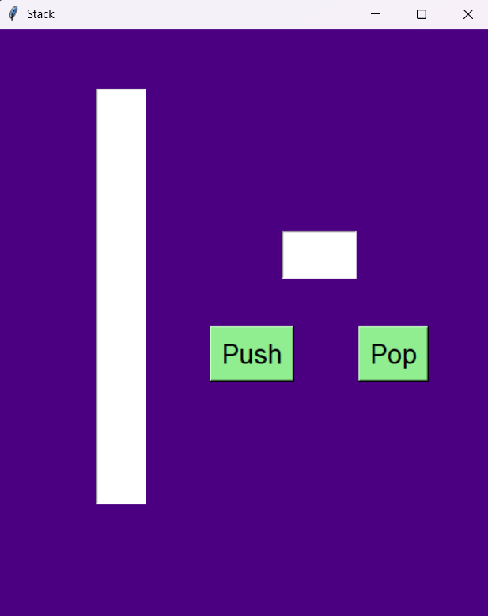

# 🏗️ Stack Visualizer  

A **Stack Visualizer** built using Python's **Tkinter** library to demonstrate stack operations (**Push & Pop**) in a **graphical user interface (GUI)**.  

---

## 🎯 Features  
✔️ **Push Operation** - Add elements to the stack.  
✔️ **Pop Operation** - Remove elements from the stack.  
✔️ **Stack Overflow Handling** - Prevents exceeding stack limits.  
✔️ **Stack Underflow Handling** - Alerts when trying to pop from an empty stack.  
✔️ **User-Friendly Interface** - Built with **Tkinter**, featuring easy interaction.  

---

## 🖥️ How It Works  
- Users enter a value in the input field and press the **Push** button to add it to the stack.  
- The stack is displayed dynamically, with new elements appearing at the **top**.  
- Clicking **Pop** removes the last added element and updates the stack visualization.  
- Handles **stack overflow** (too many elements) and **stack underflow** (removing from an empty stack).  

---

## 📌 Screenshots  

### 🔹 Stack Visualization  
  

### 🔹 Stack Overflow Alert  
  

### 🔹 Stack Underflow Alert  
  

---
